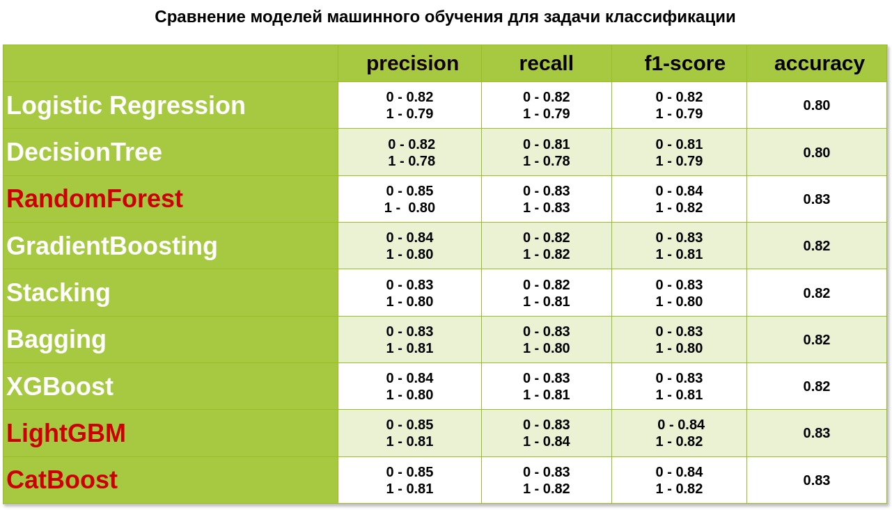

# BankMarketingPredictor

### Оглавление

[Описание проекта](#описание-проекта) 

[Задачи проекта](#задачи-проекта)  

[Структура проекта](#структура-проекта)  

[Используемые библиотеки](#используемые-библиотеки) 

[Заключительные выводы](#заключительные-выводы) 

[Установка и использование](#установка-и-использование)  

### ***Описание проекта***

Описание проекта BankMarketingPredictor — это проект, направленный на решение реальной бизнес-задачи, с которой сталкиваются аналитики в банковском секторе. Мы анализируем данные о маркетинговой кампании банка, нацеленной на привлечение клиентов для открытия депозитов.

Цель проекта — создать модель машинного обучения, которая будет предсказывать, воспользуется ли клиент предложением о депозите, исходя из данных о характеристиках клиентов. Это поможет банку лучше ориентироваться на целевую аудиторию и повысить эффективность своих маркетинговых кампаний.

:arrow_up:[к оглавлению](#оглавление)

### Задачи проекта

* Первичная обработка данных:
  
*Очистка данных от пропусков и выбросов для обеспечения их качества.*

* Разведывательный анализ данных (EDA):
  
*Исследование данных для выявления закономерностей и формулирования гипотез.*

* Отбор и преобразование признаков:
  
*Кодирование и преобразование данных для подготовки к классификации, учитывая их структуру.*

* Решение задачи классификации (Логистическая регрессия и решающие деревья):
  
*Построение первой модели и оценка её качества, подбирая оптимальные параметры для достижения лучших результатов.*

* Анализ производительности моделей с использованием методов ансамблей:
  
*Доработка предсказаний с применением более сложных алгоритмов машинного обучения для повышения качества моделирования.*

* Дополнительно будут использованы модели XGBoost, LightGBM, CatBoost:
  
*Сравним модели и подберем оптимальные параметры для достижения лучших результатов.*

   
:arrow_up:[к оглавлению](#оглавление)

### ***Структура проекта***

- [Project_4_ml.ipynb](https://github.com/Twi1ightFox/BankMarketingPredictor/blob/master/Project_4_ml.ipynb): Jupyter ноутбук.
- [README.md](https://github.com/Twi1ightFox/BankMarketingPredictor/blob/master/README.md): Описание проекта.
- [models.jpg](https://github.com/Twi1ightFox/BankMarketingPredictor/blob/master/models.jpg): Таблица сравнения метрик моделей
- [requirements.txt](https://github.com/Twi1ightFox/BankMarketingPredictor/blob/master/requirements.txt): Зависимости.

:arrow_up:[к оглавлению](#оглавление)

### Используемые библиотеки

Для работы с проектом потребуется установить следующие библиотеки:

- numpy  Линейная алгебра
- pandas Обработка и чтение данных
- sklearn  Основные модули библиотеки scikit-learn
- scipy Статистический пакет SciPy
- category_encoders Кодировщики категорий
- lightgbm 
- catboost
- xgboost
- scipy
- другие библиотеки (файл requireents.txt)
:arrow_up:[к оглавлению](#оглавление)

### Заключительные Выводы:
В процессе работы над проектом были очищены данные, заполнены пропуски, а также все данные приведены к правильному типу и корректному формату.
Были выдвинуты и подтверждены гипотезы о влияние разных признаков на вероятность открытия клиентом депозита:

- Чем выше значение баланса клиента, тем выше вероятность открытия им депозита.
- Наличие ипотеки снижает вероятность открытия депозита, точно так же как и просто наличие кредита у клиента.
- Самыми удачными месяцами по вероятности открытия депозита являются март, сентябрь, октябрь и декабрь.
- Чем более продолжительный был контакт с клиентом, тем выше вероятность открытия им депозита.
- В рамках текущей и прошлой кампании также играет роль, был ли в прошлом контакт с клиентом.
- Депозиты чаще всего открывали клиенты, с которыми общались по мобильному телефону.
- Клиенты с высшим образованием проявляли наибольшую лояльность.
- Чаще всего депозиты открывали одинокие люди.
- На вероятность открытия депозита также влиял возраст: наиболее лояльными были как молодые люди до 25 лет, так и пожилые люди старше 60 лет.

Проверена мультиколлеарность признаков, были отобраны самые важные признаки и оценен их вклад.
Были опробованы различные модели машинного обучения, подобраны оптимальные параметры, произведена оценка моделей с помощью подходящих метрик.

По итогу лучшими моделями оказались:
* RandomForest
* LightGBM
* CatBoost

Хуже всего справилась логистическая регрессия и дерево решений.

- 

:arrow_up:[к оглавлению](#оглавление)

### Установка и использование

1. Клонируйте репозиторий:
   git clone [https://github.com/Twi1ightFox/BankMarketingPredictor/tree/master.git](https://github.com/Twi1ightFox/BankMarketingPredictor/tree/master)
   
2. Загрузите необходимые файлы:
   
   (Данные для проекта)[https://lms-cdn.skillfactory.ru/assets/courseware/v1/dab91dc74eb3cb684755123d224d262b/asset-v1:SkillFactory+DSPR-2.0+14JULY2021+type@asset+block/bank_fin.zip]
   
3. Запустить Jupyter notebook для просмотра и запуска анализа.

:arrow_up:[к оглавлению](#оглавление)
